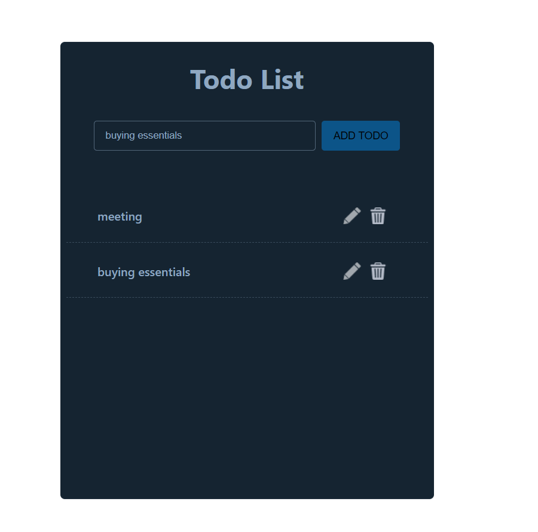
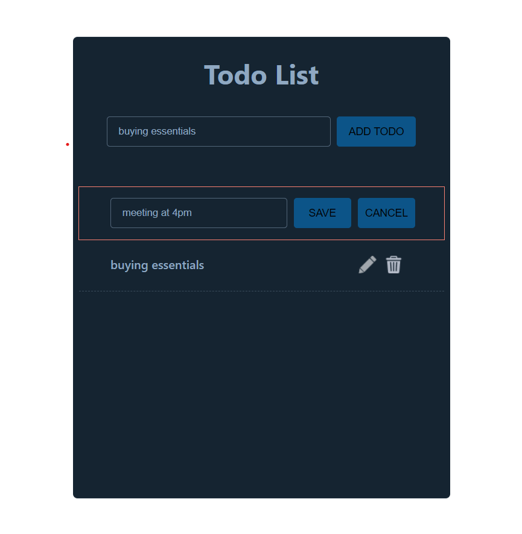
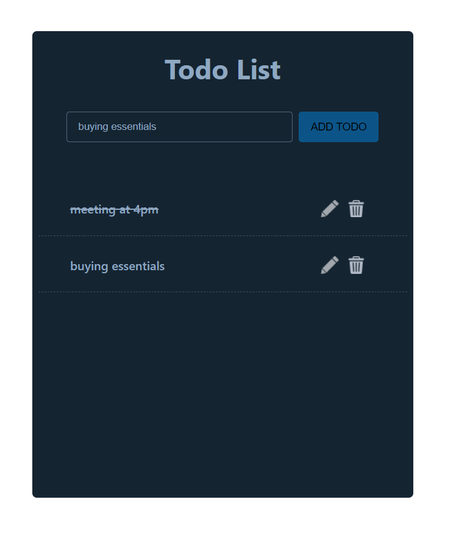
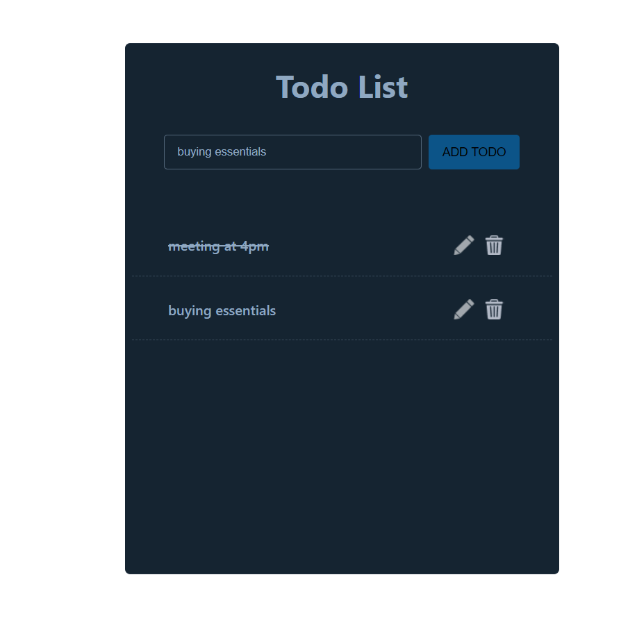

The Todo app is a simple application that allows users to manage and keep track of their tasks or to-do items. It provides features like adding new tasks, marking tasks as complete, editing existing tasks, and deleting tasks.

feat:add todo,edit todo,delete todo ,completed todo implemented using localstorage and reusable buttons,input

## Add Task

## Edit Task

## Mark As Completed by clicking on the Task

## Delete Task

